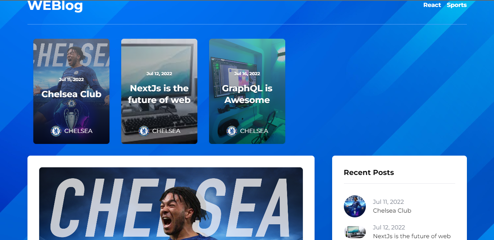

## Blog-App
This is a [Next.js](https://nextjs.org/) project bootstrapped with [`create-next-app`](https://github.com/vercel/next.js/tree/canary/packages/create-next-app).

## Table of contents

- [Overview](#overview)
  - [The challenge](#the-challenge)
  - [Screenshot](#screenshot)
  - [Links](#links)
- [My process](#my-process)
  - [Built with](#built-with)
  - [What I learned](#what-i-learned)
  - [Useful resources](#useful-resources)

## Overview

### The challenge

Users should be able to:

- View the optimal layout for the site depending on their device's screen size
- Search
- view results
- Navigate to another page

### Screenshot



### Links

- Solution URL: (https://github.com/faozziyyah/blog)
- Live Site URL: (https://blog-murex-chi.vercel.app/)

## My process
### Built with

- CSS
- [NextJs](https://nextjs.org/) - ReactJS Framework
- [Tailwind CSS](https://tailwindcss.com/) - Tailwind CSS
- [Hygraph](https://hygraph.com/) - Previously GraphCMS

### What I learned

- How to use Hygraph and GraphCMS in NextJs

```Next.js
export default async function comments(req, res) {

  const graphQLClient = new GraphQLClient(graphqlAPI, {
    headers: {
      authorization: `Bearer ${graphcmsToken}`
    },
  });

  const query = gql`
    mutation CreateComment($name: String!, $email: String!, $comment: [Comment!]!, $slug: String!, id: ID!) {
      createComment(data: { name: "$name", email: "$email", comment: "$comment", post: { connect: { slug: $slug } } }) {
        name
        email
        comment
        post
      }
    }
  `

    try {
      const result = await graphQLClient.request(query, req.body);

      return res.status(200).send(result);
    } catch (error) {
      console.log(error);
      return res.status(500).send(error);
    }

}
```

### Useful resources
## How to use

Execute [`create-next-app`](https://github.com/vercel/next.js/tree/canary/packages/create-next-app) with [npm](https://docs.npmjs.com/cli/init), [Yarn](https://yarnpkg.com/lang/en/docs/cli/create/), or [pnpm](https://pnpm.io) to bootstrap the example:

```bash
npx create-next-app --example with-tailwindcss with-tailwindcss-app
# or
yarn create next-app --example with-tailwindcss with-tailwindcss-app
# or
pnpm create next-app --example with-tailwindcss with-tailwindcss-app
```
## Getting Started

First, run the development server:

```bash
npm run dev
# or
yarn dev
```

Open [http://localhost:3000](http://localhost:3000) with your browser to see the result.

You can start editing the page by modifying `pages/index.js`. The page auto-updates as you edit the file.

[API routes](https://nextjs.org/docs/api-routes/introduction) can be accessed on [http://localhost:3000/api/hello](http://localhost:3000/api/hello). This endpoint can be edited in `pages/api/hello.js`.

The `pages/api` directory is mapped to `/api/*`. Files in this directory are treated as [API routes](https://nextjs.org/docs/api-routes/introduction) instead of React pages.

## Next.js + Tailwind CSS Example

This example shows how to use [Tailwind CSS](https://tailwindcss.com/) [(v3.0)](https://tailwindcss.com/blog/tailwindcss-v3) with Next.js. It follows the steps outlined in the official [Tailwind docs](https://tailwindcss.com/docs/guides/nextjs).

## Learn More

To learn more about Next.js, take a look at the following resources:

- [Next.js Documentation](https://nextjs.org/docs) - learn about Next.js features and API.
- [Learn Next.js](https://nextjs.org/learn) - an interactive Next.js tutorial.

You can check out [the Next.js GitHub repository](https://github.com/vercel/next.js/) - your feedback and contributions are welcome!

## Deploy on Vercel

Deploy the example using [Vercel](https://vercel.com?utm_source=github&utm_medium=readme&utm_campaign=next-example) or preview live with [StackBlitz](https://stackblitz.com/github/vercel/next.js/tree/canary/examples/with-tailwindcss)

[](https://vercel.com/new/git/external?repository-url=https://github.com/vercel/next.js/tree/canary/examples/with-tailwindcss&project-name=with-tailwindcss&repository-name=with-tailwindcss)

Deploy it to the cloud with [Vercel](https://vercel.com/new?utm_source=github&utm_medium=readme&utm_campaign=next-example) ([Documentation](https://nextjs.org/docs/deployment)).